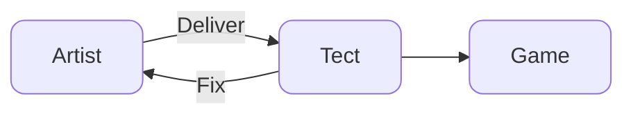
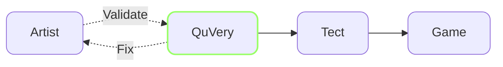
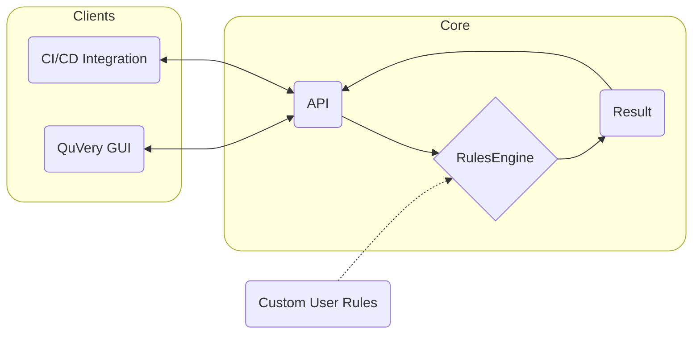

### Asset Management in Game Development with QuVery

QuVery validates art assets before they are delivered to the technical team or imported into the game engine.

#### Normal Asset Pipeline

Too many iterations might happen.

---

#### QuVery Pipeline

QuVery automatically validates assets and reports issues.

### The Challenge in Game Development

A significant part of the game development process involves repairing and preparing assets to be used in game engines. This process, often considered basic yet crucial, requires a thorough understanding of asset creation rules and principles. Traditionally, these tasks falls on artists and technical art teams, consuming valuable time and resources.

- Artists creates the asset.
- The asset will be delivered to a technical artist or will be imported into the game engine by the artist themselves.
- The asset will be tested in the game.
- The asset might have visible or invisible issues.
  - Visible issues needed to be fixed by the technical artist or the artist themselves.
  - Invisible issues will create performance issues later and separate tasks to debug, find and resolve them.

### Introducing QuVery: A Fast and Powerful Solution

QuVery emerges as a specialized tool designed to empower artists and streamline the asset management process. It allows artists to independently check their assets for potential issues, such as missing or broken textures, materials, unapplied transforms, isolated vertices and much more. QuVery stands out for its ability to incorporate custom validation rules. This means it can be tailored to specific needs, such as the use of particular shaders, materials, or adhering to unique pipeline standards.

A simple GUI client for QuVery written in Godot.

### QuVery: Structure and Functionality

The core part of QuVery contains a Rules Engine and an API. The Rules Engine is responsible for running the validation rules and the API is responsible for communicating with the clients. The clients can be a GUI tool or a CI/CD pipeline.

### Beyond a GUI Tool: Integration into CI/CD Pipelines

QuVery is not just a GUI tool for artists but also its compatibility with Continuous Integration/Continuous Deployment (CI/CD) pipelines. By integrating QuVery Core into these pipelines, it's possible to validate all existing or new assets in the project repository. This integration ensures a comprehensive quality check across the board, enhancing the overall production process's efficiency and output quality.

### The Impact of QuVery

Implementing QuVery in the game development workflow promises significant benefits. It ensures that most common asset-related issues are resolved before reaching the technical team. This preemptive approach saves time, reduces workload, and optimizes resource allocation. The result is a more streamlined, efficient production process, allowing teams to focus more on creativity and innovation.

### Looking Ahead

QuVery represents a significant step forward in tackling the often-overlooked challenges of asset management in game development.
We can easily develop plugins for Blender, Maya, 3ds Max, etc. to integrate QuVery into the artist's workflow and let the artist validate their assets while they are working on them!

### How to get QuVery?

There are two parts of QuVery:

- QuVery Core: The core part of QuVery which contains the Rules Engine and the API.
- QuVery GUI: A simple GUI client for QuVery written in Godot.

If you are an artist, you can use QuVery GUI to validate your assets. If you are a technical artist or a developer, you can integrate QuVery Core into your CI/CD pipeline.

[QuVery Core Repository](https://github.com/QuVery/quvery-core)

[QuVery GUI Repository](https://github.com/QuVery/quvery-gui)
